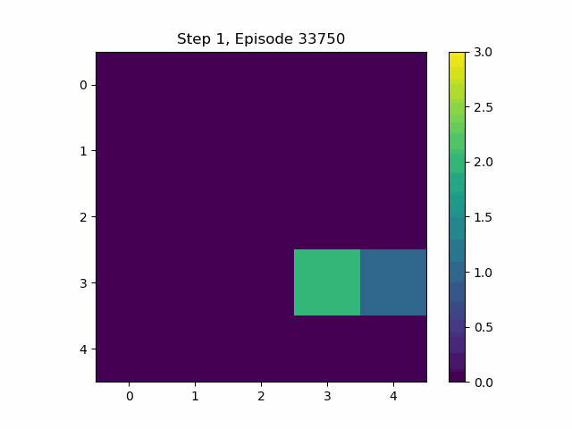

# MARL with Rock-Paper-Scissor: Introducing RL BattleGround

We provide a library for a multi species multi-agent reinforcement learning (MARL) using Deep Q-Networks (DQN) applied to the battle arena game of Rock-Paper-Scissors.

## library Structure

```
resources/
scripts/
src/
├── args.py
├── config.yaml
├── test.py
├── train.py
├── gym/
│   ├── __init__.py
│   ├── test.py
│   └── my_env/
│       ├── __init__.py
│       ├── config.py
│       └── environment.py
├── models/
│   ├── dqn.py
│   ├── get_model.py
README.md
```

## Code File Descriptions

- **src/args.py**: Handles command-line argument parsing for training and testing.
- **src/config.yaml**: Contains configuration parameters for the library.
- **src/test.py**: Script for testing the trained models.
- **src/train.py**: Script for training the agents.
- **src/gym/\_\_init\_\_.py**: Initializes the custom Gym environments.
- **src/gym/test.py**: Tests the custom Gym environment independently.
- **src/gym/my_env/\_\_init\_\_.py**: Initializes the custom Rock-Paper-Scissors environment module.
- **src/gym/my_env/config.py**: Configuration settings for the custom environment.
- **src/gym/my_env/environment.py**: Defines the Rock-Paper-Scissors environment logic.
- **src/models/dqn.py**: Implementation of the Deep Q-Network model.
- **src/models/get_model.py**: Utility functions to retrieve model instances.
- **README.md**: Provides an overview and instructions for the library.

## Demonstartion of Our Results





## Installation

1. Clone the repository:

    ```bash
    git clone https://github.com/yourusername/MARL-with-Rock-Paper-Scissor.git
    ```

2. Navigate to the library directory:

    ```bash
    cd MARL-with-Rock-Paper-Scissor
    ```

3. Install the required packages:

    ```bash
    pip install -r requirements.txt
    ```

## Usage

### Training

Run the training script:

```bash
python src/train.py --config src/config.yaml
```

### Testing

Run the test script:

```bash
python src/test.py --config src/config.yaml
```

## Configuration

Modify the `config.yaml` file to adjust training parameters and settings.
